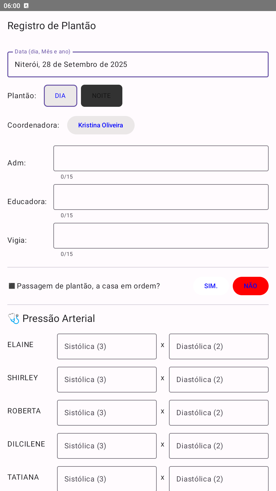
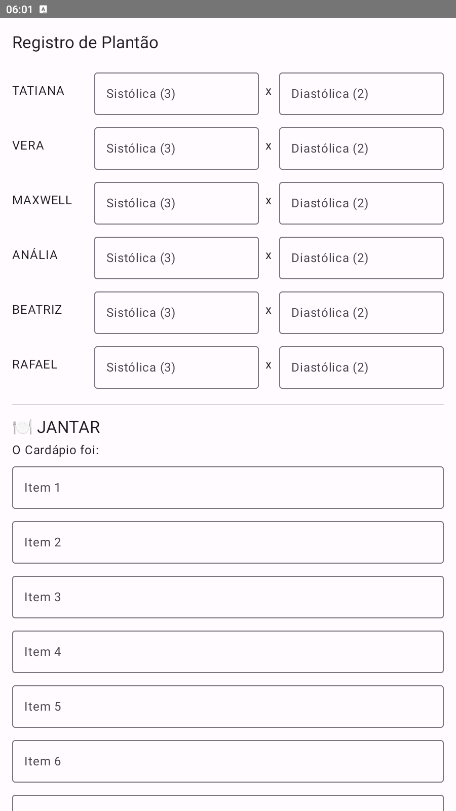
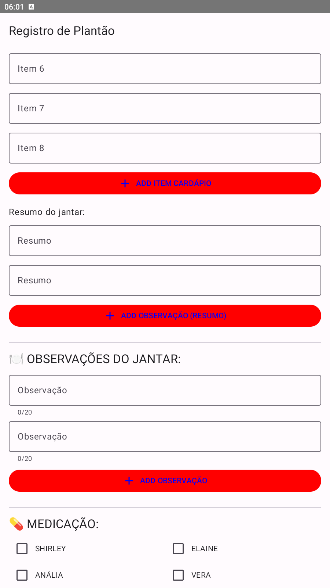
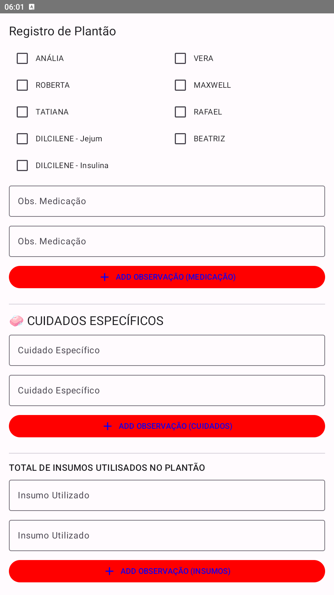
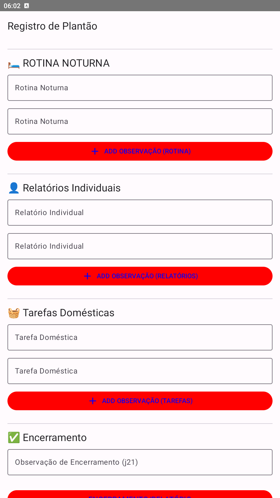
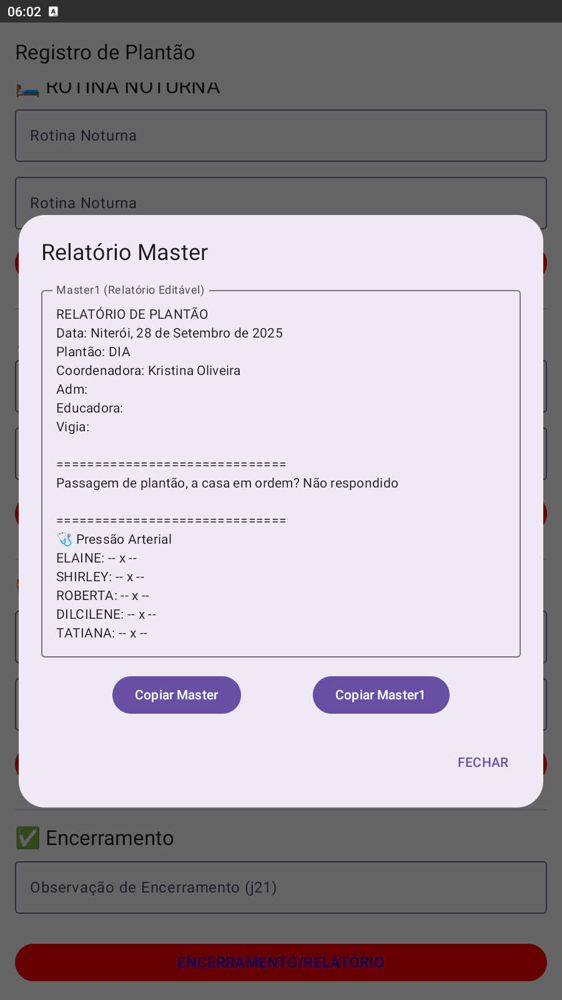

# 🏥 Registro de Plantão

Aplicativo Android desenvolvido para auxiliar profissionais em ambientes de cuidado na organização de informações durante o plantão. Criado com apoio de inteligência artificial, o app oferece uma interface intuitiva para registrar dados clínicos, tarefas realizadas, observações e relatórios finais.

---

## 🌐 Idiomas Disponíveis / Available Languages / Idiomas Disponibles

- 🇧🇷 Português do Brasil
- 🇬🇧 English
- 🇪🇸 Español

---

## 🇧🇷 Funcionalidades

- Tela Inicial e Dados Gerais
- 📋 Cardápio e Observações do Jantar
- 💊 Medicação e Cuidados Específicos
- 🌙 Rotina Noturna, Relatórios e Tarefas
- 📘 Relatório Master Editável
- 💉 Pressão Arterial e Cateterismo

📦 [Baixar APK de teste](app-debug.apk)  
🔗 [Ver repositório no GitHub](https://github.com/thiagoplacido/registro-plantao)

---

## 🇬🇧 Features

- Home Screen and General Data
- 📋 Dinner Menu and Observations
- 💊 Medication and Specific Care
- 🌙 Night Routine, Reports and Tasks
- 📘 Editable Master Report
- 💉 Blood Pressure and Catheterization

📦 [Download test APK](app-debug.apk)  
🔗 [View GitHub repository](https://github.com/thiagoplacido/registro-plantao)

---

## 🇪🇸 Funcionalidades

- Pantalla inicial y datos generales
- 📋 Menú de cena y observaciones
- 💊 Medicación y cuidados específicos
- 🌙 Rutina nocturna, informes y tareas
- 📘 Informe Master editable
- 💉 Presión arterial y cateterismo

📦 [Descargar APK de prueba](app-debug.apk)  
🔗 [Ver repositorio en GitHub](https://github.com/thiagoplacido/registro-plantao)

---

## 📸 Galeria de Imagens

  
  
  
  
  
  

<!-- Lightboxes -->

  ×
  

×

×

×

×

×

---

## 📦 Build

- Versão / Version / Versión: `0.1`  
- Última Atualização / Last Update / Última Actualización: `2023-07-10`  
- Ambiente / Environment / Entorno: `Produção / Production`

---

## ✍️ Autor / Author / Autor

**Thiago Placido**  
Desenvolvedor iniciante com perfil investigativo e realista. Apaixonado por soluções práticas, interfaces funcionais e tecnologia com propósito.

---

## 📄 Licença / License / Licencia

Este projeto está sob a licença MIT.  
This project is under the MIT License.  
Este proyecto está bajo la licencia MIT.
