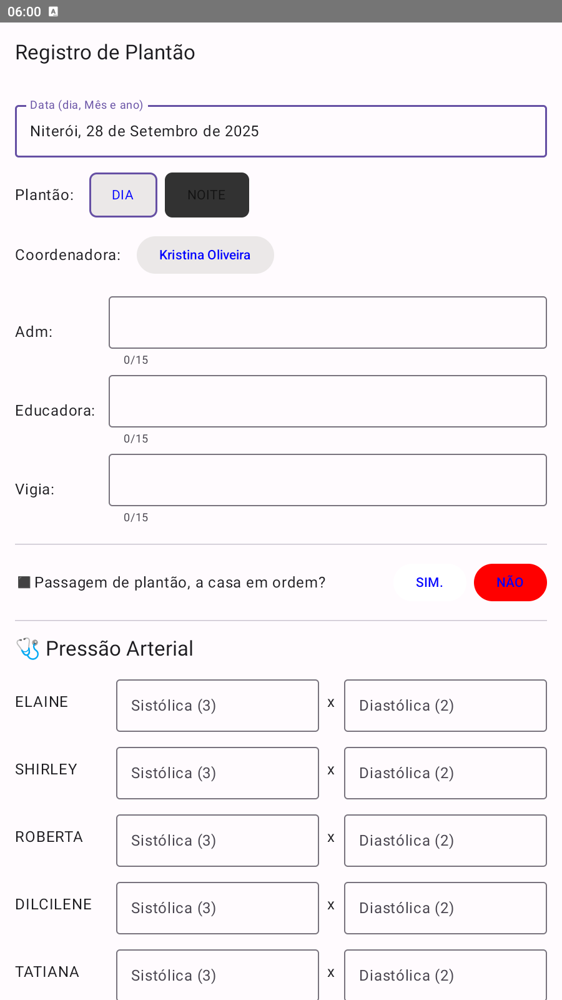
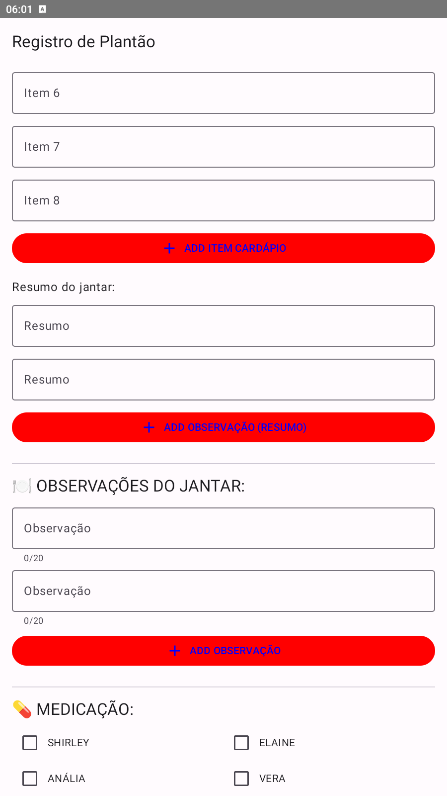
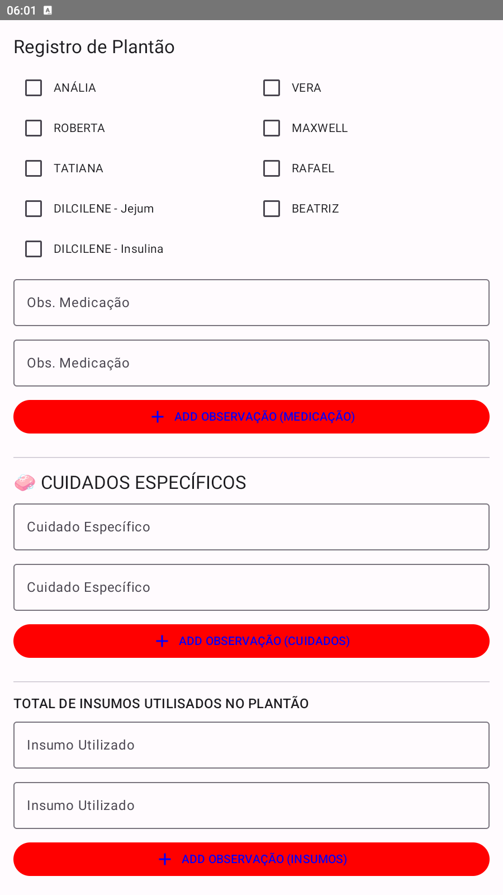
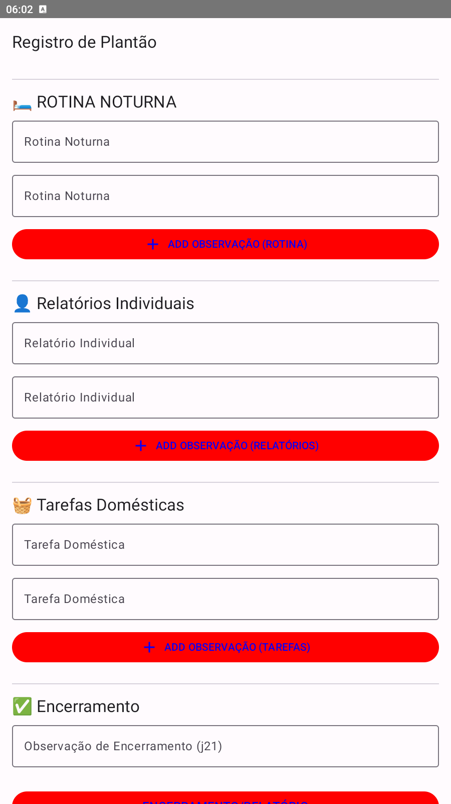
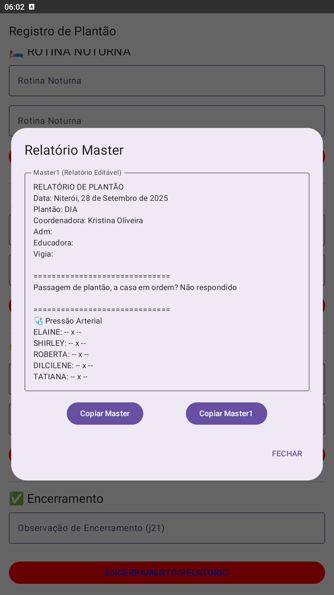

# 🏥 Registro de Plantão

Aplicativo Android desenvolvido para auxiliar profissionais em ambientes de cuidado na organização de informações durante o plantão. Criado com apoio de inteligência artificial, o app oferece uma interface intuitiva para registrar dados clínicos, tarefas realizadas, observações e relatórios finais.

---

## 🇧🇷 Funcionalidades

- Registro de pressão arterial por residente
- Marcação de medicação, jejum e insulina
- Cardápio do jantar com campos dinâmicos
- Observações por seção com botões de adição
- Relatório final editável e copiável ("Master")
- Interface com botões interativos e campos inteligentes

---

## 🇬🇧 Features

- Blood pressure logging per resident
- Medication, fasting, and insulin tracking
- Dynamic dinner menu input
- Section-based observations with add buttons
- Editable and copyable final report ("Master")
- Interactive interface with smart input fields

---

## 🇪🇸 Funcionalidades

- Registro de presión arterial por residente
- Seguimiento de medicación, ayuno e insulina
- Menú de cena con campos dinámicos
- Observaciones por sección con botones de adición
- Informe final editable y copiable ("Master")
- Interfaz interactiva con campos inteligentes

---

## 🛠️ Tecnologias / Technologies / Tecnologías

- Android Studio  
- Kotlin *(ou Java)*  
- Gradle  
- Inteligência Artificial aplicada à lógica de interface  
- Artificial Intelligence applied to interface logic  
- Inteligencia Artificial aplicada a la lógica de interfaz

---

## 📸 Capturas de Tela / Screenshots / Capturas de Pantalla

### 🧾 Tela Inicial e Dados Gerais

### 🍽️ Cardápio e Observações do Jantar

### 💊 Medicação e Cuidados Específicos

### 🛏️ Rotina Noturna, Relatórios e Tarefas

### 📋 Relatório Master Editável

### 🩺 Pressão Arterial e Cardápio

---

## 📦 Build

- Versão / Version / Versión: `1.0`  
- Tipo / Type / Tipo: `Debug`  
- Min SDK: `24` (Android 7.0)  
- Arquivo de metadados / Metadata file / Archivo de metadatos: `output-metadata.json`

---

## ✍️ Autor / Author / Autor

**Thiago Placido**  
Desenvolvedor iniciante com perfil investigativo e realista. Apaixonado por soluções práticas, interfaces funcionais e tecnologia com propósito. Explorando IA, apps Android e automações úteis.

Beginner developer with an investigative and realistic profile. Passionate about practical solutions, functional interfaces, and purposeful technology. Exploring AI, Android apps, and useful automations.

Desarrollador principiante con perfil investigativo y realista. Apasionado por soluciones prácticas, interfaces funcionales y tecnología con propósito. Explorando IA, aplicaciones Android y automatizaciones útiles.

---

## 📄 Licença / License / Licencia

Este projeto está sob a licença MIT.  
This project is under the MIT License.  
Este proyecto está bajo la licencia MIT.

Sinta-se livre para usar, modificar e contribuir.  
Feel free to use, modify, and contribute.  
Siéntete libre de usar, modificar y contribuir.
``
