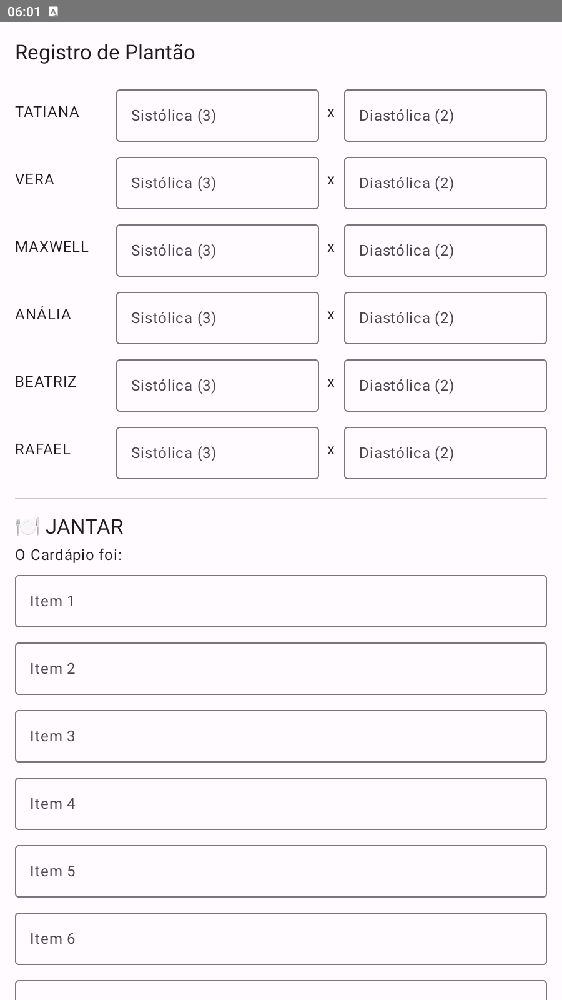
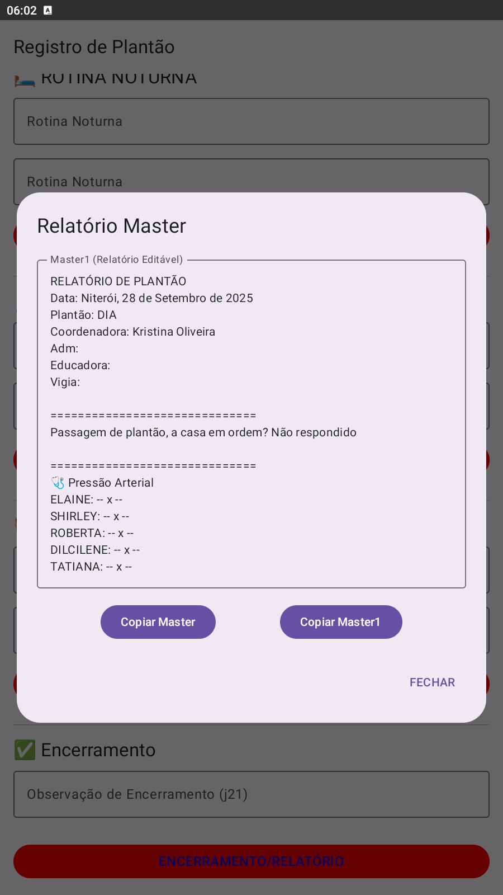

# 🏥 Registro de Plantão

Aplicativo Android para registro de atividades em plantões de cuidado.  
Organize pressão arterial, medicação, cardápio, observações e relatórios com uma interface prática e inteligente.

---

## Idiomas / Languages / Idiomas

- 🇧🇷 Português
- 🇬🇧 English
- 🇪🇸 Español

---

## Funcionalidades / Features / Funcionalidades

- 📋 Cardápio e Observações do Jantar / Dinner Menu and Observations / Menú de cena y observaciones  
- 💊 Medicação e Cuidados Específicos / Medication and Specific Care / Medicación y cuidados específicos  
- 🌙 Rotina Noturna, Relatórios e Tarefas / Night Routine, Reports and Tasks / Rutina nocturna, informes y tareas  
- 📘 Relatório Master Editável / Editable Master Report / Informe Master editable  
- 💉 Pressão Arterial e Cateterismo / Blood Pressure and Catheterization / Presión arterial y cateterismo

---

## 📦 Downloads

- 🔗 [Ver repositório no GitHub](https://github.com/thiagoplacido/registro-plantao)  
- 📥 [Baixar APK de teste](app-debug.apk)

---

## 📸 Imagens do App

  
  
  
  
  

---

## 📦 Build

- Versão: `0.1`  
- Última Atualização: `2023-07-10`  
- Ambiente: `Produção`

---

## ✍️ Sobre o Autor

**Thiago Placido**  
Desenvolvedor iniciante com perfil investigativo e realista. Apaixonado por soluções práticas, interfaces funcionais e tecnologia com propósito.

---

## 📄 Licença

MIT License — livre para usar, modificar e contribuir.
